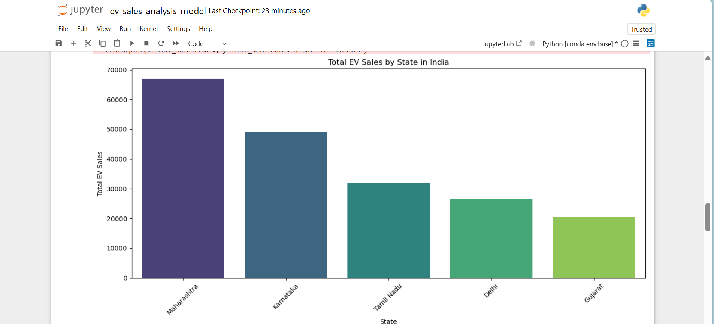

# electric-vehicle-sales-prediction-india
Predicting Electric Vehicle sales in Indian states using ML and data analysis.

# 🔋 Electric Vehicle Sales Prediction (India)

This project aims to predict Electric Vehicle (EV) sales across Indian states using a supervised machine learning approach — **Linear Regression**. It demonstrates a simple end-to-end regression workflow including data preprocessing, encoding, training, and evaluation.

> ⚠️ *Note: This project is built using a small sample dataset and is intended for learning and practice purposes.*

---

## 📁 Dataset Overview

The dataset contains:
- `State`: Indian state name
- `Year`: Sales year
- `EV_Type`: Type of EV (e.g., 2-Wheeler, 4-Wheeler)
- `Sales`: Number of vehicles sold (Target variable)

📄 File: `data/ev_sales_india.csv`

---

## 🧠 Problem Statement

Use machine learning (Linear Regression) to:
- Understand trends in EV adoption across states and years
- Predict EV sales based on available features

---

## 🧪 Tools & Technologies Used

| Tool           | Purpose                        |
|----------------|-------------------------------|
| Python         | Programming language           |
| Pandas, NumPy  | Data handling and transformation |
| Matplotlib, Seaborn | Data visualization       |
| Scikit-learn   | ML model (Linear Regression)   |
| Jupyter Notebook | Model development            |

---

## 📊 Exploratory Data Analysis (EDA)

EDA includes:
- State-wise and EV-type-wise sales overview
- Year-wise EV sales trends
- Data encoding and preprocessing
- Scatter plot: Actual vs Predicted Sales

📸 *Sample Visualization:*  
 <!-- Replace with your image path -->

---

## 🔍 Model Summary

- **Model**: Linear Regression
- **Features Used**: Year, State (encoded), EV Type (encoded)
- **Target**: Sales

### ✅ Evaluation Metrics:
| Metric | Description             |
|--------|-------------------------|
| MAE    | Mean Absolute Error     |
| RMSE   | Root Mean Squared Error |
| R²     | R-squared Score         |

---

## 🚀 How to Run

1. Clone the repo:
```bash
git clone https://github.com/PoojaChoudhary-01/electric-vehicle-sales-prediction-india

